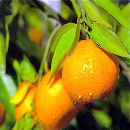
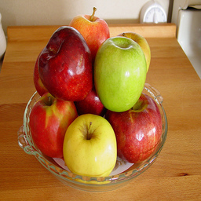
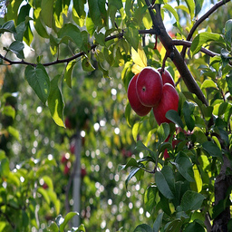

# Cycle-MobiGAN

## Overview

This project was done as part of the bachelor thesis at Tilburg University. This repository contains more structured code with notebooks and results with different datasets. The purpose of this project was to investigate that to what extent does modifying CycleGAN architecture with depthwise separable convolution and inverted residual blocks as introduced in MobileNet and MobileNet v2 effect computational efficiency and generated image quality.
The methodology section below provides details of architectures and training parameters, whereas, the results section displays the results.

The structure of the repository is described below:

```bash
Cycle-MobiGAN/
├── Dataset/
│   ├── Dataset.py
├── Models/
│   ├── Blocks.py
│   └── Discriminators.py
│   ├── Generators.py
│   └── Loss_functions.py
├── Train py files/
│   ├── train_CycleGAN.py
│   └── train_CycleGAN_DWS.py
│   ├── train_CycleGAN_IR_DWS.py
└── Utils/
   ├── visualize_images.py
```

Each subfolder has it's own README.md that explains what files that folders contains and their purpose.

## Introduction

## Methodology

## Results


Figure 1: Generated images in domain Y (oranges) using images in domain X (apples). X -> Y mapping
|       | Real Image                    | CycleGAN                      | Cycle-MobiGAN V1              | Cycle-MobiGAN V2              |
|-------|-------------------------------|-------------------------------|-------------------------------|-------------------------------|
| 1     |  |  |  |  |
| 2     |  |  |  |  |
| 3     |  |  |  |  |

Figure 2: Generated images in domain X (apples) using images in domain Y (oranges). Y -> X mapping
|       | Real Image                    | CycleGAN                      | Cycle-MobiGAN V1              | Cycle-MobiGAN V2              |
|-------|-------------------------------|-------------------------------|-------------------------------|-------------------------------|
| 1     |  |  |  |  |
| 2     |  |  |  |  |
| 3     |  |  |  |  |

