# Cycle-MobiGAN

## Overview

This project was done as part of the bachelor thesis at Tilburg University. The purpose of this project was to explore if CycleGAN architecture can be modified to increase efficiency (faster training/inference times) without compromising generated image quality. The motivation for this being the robotics research being conducted at AI for Robotics Lab at Tilburg University. One of the research projects had an unpaired image to image translation problem. Since the compute resources are limited in a robot, a more efficient CycleGAN architecture was explored by utilizing the depthwise seperable convolutions and inverted residual blocks as introduced in MobileNet and MobileNetV2 respectively.
The models section below provides details of architectures and training parameters, whereas, the results section displays the results.
The code was originally written for the horse2zebra dataset, therefore some comments might refer to it.

The structure of the repository is described below:

```bash
Cycle-MobiGAN/
├── Dataset/
│   ├── Dataset.py
├── Models/
│   ├── Blocks.py
│   └── Discriminators.py
│   ├── Generators.py
│   └── Loss_functions.py
├── Train py files/
│   ├── train_CycleGAN.py
│   └── train_CycleGAN_DWS.py
│   ├── train_CycleGAN_IR_DWS.py
└── Utils/
   ├── visualize_images.py
```

Each subfolder has it's own README.md that explains what files that folders contains and their purpose.

## Training The Models
The models can be trained using the jupyter files in the main directory of this repository. The corresponing python files are in training py files.

## Models

Initially three models were trained which are detailed below. The models were trained for 200 epochs with a batch size of 1. Adam optimizer was used with a learning rate of 0.0002 and betas being 0.5 and 0.999 respectively. The cycle consistency loss and identity loss weights were selected to be 10. Unlike the original implementation a running buffer of images was not used to update the discriminators.

### CycleGAN
The architecture was same as introduced in the original CycleGAN paper. The number of residual blocks for the generators was chosen to be 9. PatchGAN discriminators were used.
### CycleGAN Depthwise Separable (CG_DWS or Cycle MobiGAN V1)
The architecture of this model was same as CycleGAN except all convolutional layers in generators including the transpose convolutions were replaced by depthwise seperable convolutions. The discriminators were PatchGAN discriminators with all convolution layers replaced with depthwise seperable convolutions. This model is a fusion of CycleGAN and MobileNet, therefore, it's name Cycle MobiGAN V1.
### CycleGAN Depthwise Separable and Inverted Residual (CG_IR_DWS or Cycle MobiGAN V2)
The architecture of this model was same as Cycle MobiGAN except all residual blocks in  the generators were replaced by inverted residual blocks as introduced in MobileNet V2. This model is a fusion of CycleGAN and MobileNet V2, therefore, it's name Cycle MobiGAN V2.
### CycleGAN Depthwise Separable and Inverted Residual Full Discriminator (CG_IR_DWS_FD or Cycle MobiGAN V2 FD)
The architecture of this model was same as Cycle MobiGAN V2 except the discriminators utilized normal convolution layers instead of depthwise seperable convolutions. This architecture was explored because the previous two (MobiGAN and MobiGAN V2) did not have very encouraging results. The possible cause was very few parameters in generators and discriminators. The discrimanators had  much less parameters in the previous two architectures, therefore, the intuition was that good image quality can be achieved by just modify the discriminators.

## Results
The results DO NOT contain the best case or worst case scenarios.

### Apples and Oranges Dataset
Figure 1: Generated images in domain X (apples) using images in domain Y (oranges). Y -> X mapping
|       | Real Image                    | CycleGAN                      | Cycle-MobiGAN V1              | Cycle-MobiGAN V2              | Cycle-MobiGAN V2 FD |
|-------|-------------------------------|-------------------------------|-------------------------------|-------------------------------|-------------------------------|
| 1     |  |  | 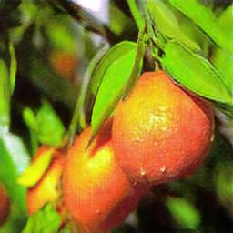 | 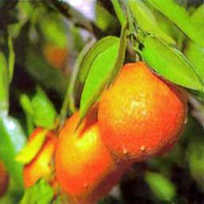 | 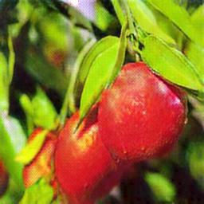 |
| 2     |  | 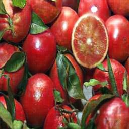 | 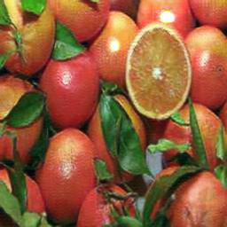 |  | 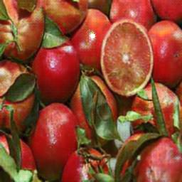 |
| 3     | 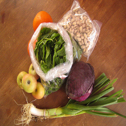 |  |  |  | 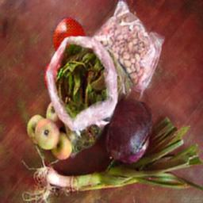 |

Figure 2: Generated images in domain Y (oranges) using images in domain X (apples). X -> Y mapping
|       | Real Image                    | CycleGAN                      | Cycle-MobiGAN V1              | Cycle-MobiGAN V2              | Cycle-MobiGAN V2 FD |
|-------|-------------------------------|-------------------------------|-------------------------------|-------------------------------|-------------------------------|
| 1     | 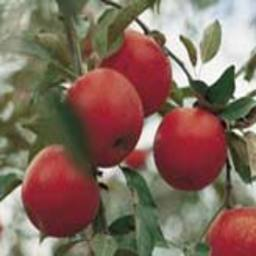 | 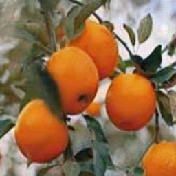 | 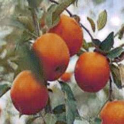 | 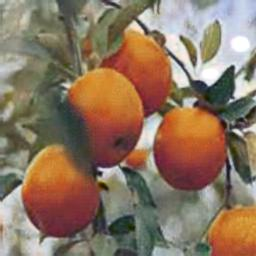 | 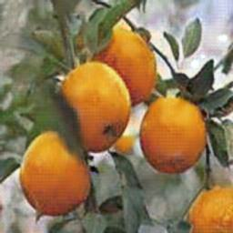 |
| 2     | 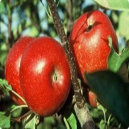 | 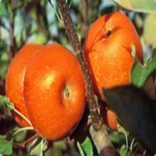 | 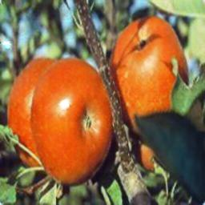 |  | 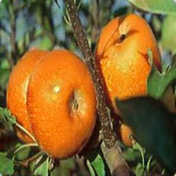 |
| 3     | 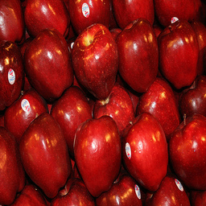 | 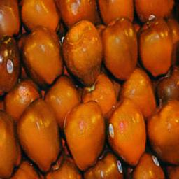 |  | 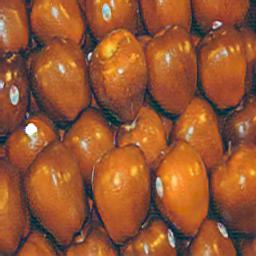 | 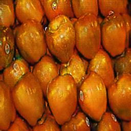 |
